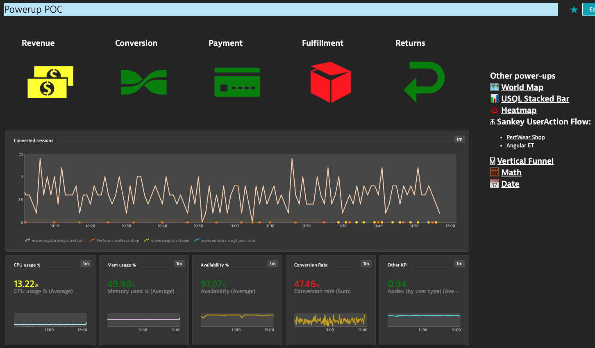

## Powerups Demo (by Lucas Hocker)
This is dashboard pack demonstrates some of the capabilities included in Dynatrace Dashboard Powerups. 

Please note: Powerups is a community project and not part of the official Dynatrace product. 
The Powerups extension will introduce capabilities that may be considered for future releases (e.g. BizAnalytics maps by expanded kpi’s [like revenue or frustrated users], heatmaps, and user session maps).
      The Powerups extension is community supported and NOT supported through normal support channels in ANY way.  Community support will be provided through <a href="https://github.com/LucasHocker/DynatraceDashboardPowerups/issues" target="_blank">GitHub Issues</a>.
      The Powerups extension will not make any callouts or otherwise interact with anything other than dashboard elements.
      Chrome is the only supported browser.
      <i>The Powerups extension is provided without any representations, warranties, or formal support from Dynatrace.</i>

